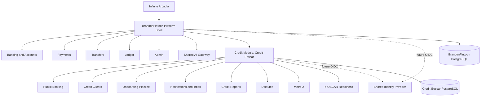

# Unified Platform Architecture

## Overview

Infinite Arcadia is the parent ecosystem. BrandonFintech is the target primary fintech platform shell. Credit-Eoscar is the credit repair, e-OSCAR readiness, Metro 2, bureau upload, credit report, tradeline, onboarding, and credit analytics module.

This document records the current architecture and the safe integration path. It does not replace working apps, merge production databases, or claim unfinished integrations.

## Current Architecture

### Credit-Eoscar

- Frontend: React, Vite, TypeScript, Wouter, existing Infinite Arcadia / Credit-Eoscar layout.
- Backend: Node.js, Express, session authentication, CSRF protection, rate limiting, security headers, status endpoints, and `/api/v1` route support.
- Data: PostgreSQL through Drizzle schema and migrations.
- Core data tables: `users`, `clients`, `notifications`, `onboarding_steps`, `client_documents`, dispute/credit workflow tables, `document_room_items`, `audit_events`, and readiness records.
- Deployment: Dockerfile, Docker Compose, staging/production docs, `/health`, `/live`, `/ready`, and admin status endpoints.
- Working flow to preserve: public booking, signup, client creation, onboarding status, admin dashboard visibility, admin notifications, system inbox, notifications feed.

### BrandonFintech

- Frontend: React, Vite, TypeScript, React Router.
- Backend: .NET 9 ASP.NET Core Web API.
- Data: PostgreSQL through EF Core migrations.
- Core projects: `BrandonFintech.Api`, `BrandonFintech.Contracts`, `BrandonFintech.Infrastructure`, `BrandonFintech.Identity`, `BrandonFintech.Accounts`, `BrandonFintech.Ledger`, `BrandonFintech.Payments`, `BrandonFintech.Transfers`, `BrandonFintech.Audit`, `BrandonFintech.Admin`, `BrandonFintech.Common`.
- Core data: `Users`, `Accounts`, `LedgerEntries`, `Payments`, `Transfers`, `AuditLogs`, `IdempotencyKeys`.
- Security: JWT bearer auth, role-based admin endpoints, CORS allowlist, security headers, rate limiting, health/ready endpoints.
- Deployment: API deployment docs, frontend Cloudflare/Vercel notes, Cloudflare Worker/Ollama AI scaffold.

## Shared Services Inventory

These capabilities exist in both systems or should be shared later:

| Capability | Credit-Eoscar Current | BrandonFintech Current | Target Direction |
| --- | --- | --- | --- |
| Authentication | Express sessions | JWT bearer | Future OIDC/SSO bridge |
| Authorization | Admin middleware, RBAC docs | ASP.NET roles | Shared permission vocabulary |
| MFA | TOTP readiness | Admin MFA planned | Shared admin MFA policy |
| Notifications | System/admin inbox | No full shared framework | Platform notification service |
| Audit logging | `audit_events`, notifications | `AuditLogs` | Correlated audit events |
| Payments | Credit billing readiness | Stripe PaymentIntents | Product-specific Stripe routing |
| AI | OpenAI/local provider readiness | Worker/Ollama scaffold | Shared AI gateway |
| Config | Env vars, `.env.example`, status endpoints | appsettings/env vars | Shared config naming conventions |
| Validation | Zod/Drizzle | DTO validation | Shared response/error standards |

## Duplicate Functionality

Duplicates should not be merged immediately. They should be normalized by contract and then migrated after staging proof.

- Users: Credit-Eoscar `users` and BrandonFintech `Users`.
- Admin roles: Express session admin checks and ASP.NET role claims.
- Audit: Credit-Eoscar `audit_events` and BrandonFintech `AuditLogs`.
- Payments: Credit service billing readiness and BrandonFintech PaymentIntent funding.
- Status checks: Credit-Eoscar `/status/*` and BrandonFintech `/health`, `/ready`, `/api/v1/platform/status`.
- AI: Credit-Eoscar AI providers and BrandonFintech Cloudflare Worker/Ollama gateway.

## Authentication

Current systems must remain independent:

- Credit-Eoscar sessions must keep CSRF protection.
- BrandonFintech JWT must keep issuer/audience/signing-key validation.

Target:

1. Add a shared identity decision record.
2. Use OIDC/SSO or an identity broker.
3. Map roles and permissions through claims.
4. Keep product-local authorization for high-risk workflows.
5. Require admin MFA across both products before real-user unification.

## Authorization

Permission inheritance must not be automatic across products. A BrandonFintech admin should not automatically gain Credit-Eoscar permissions to approve legal documents, bureau actions, receivable eligibility, or lender-visible status.

Recommended permission groups:

- `platform.admin`
- `platform.support`
- `finance.admin`
- `finance.ledger.read`
- `finance.payments.write`
- `credit.admin`
- `credit.client.read`
- `credit.client.write`
- `credit.disputes.write`
- `credit.metro2.review`
- `credit.bureau.production`
- `credit.document.approve`
- `audit.read`

## Notification Systems

Credit-Eoscar remains the source of truth for credit workflow notifications. The first shared notification step should be read-only summary integration:

- unread count
- newest credit notifications
- source module
- severity
- linked module route

Do not migrate notification writes until retention, audit, and role semantics match.

## Database Schemas

Do not merge databases in Phase 1.

### BrandonFintech Owns

- Users
- Accounts
- Ledger entries
- Payments
- Transfers
- Audit logs
- Idempotency keys

### Credit-Eoscar Owns

- Credit users and staff records until shared identity exists
- Clients
- Onboarding steps
- Notifications
- Credit reports and client documents
- Disputes
- Metro 2 workflow records
- Document Room
- Audit events
- Credit readiness records

### Shared Reference Model

Future linking should use correlation IDs:

- `platform_user_id`
- `credit_client_id`
- `source_system`
- `external_reference_id`
- `correlation_id`
- `audit_event_id`

No SSNs, bureau files, financial ledger rows, or payment credentials should be duplicated through a reference table.

## API Routes

### Credit-Eoscar

- Public booking: `/api/book-consultation`
- Auth: `/api/auth/*`, `/api/v1/auth/*`
- Clients: `/api/clients`, `/api/v1/clients`
- Notifications: `/api/notifications`, `/api/v1/notifications`
- Onboarding: `/api/onboarding/*`, `/api/v1/onboarding/*`
- Status: `/live`, `/health`, `/ready`, `/status/*`
- Credit workflows: AI, bureau, Metro 2, disputes, documents, automation.

### BrandonFintech

- Auth: `/api/v1/auth/*`
- Accounts: `/api/v1/accounts`
- Payments: `/api/v1/payments/*`
- Transfers: `/api/v1/transfers/*`
- Dashboard: `/api/v1/dashboard/summary`
- Transactions: `/api/v1/transactions`
- Admin: `/api/v1/admin/*`
- Platform: `/health`, `/ready`, `/api/v1/platform/status`

## Frontend Routes

The target main shell should live in BrandonFintech Web. Initial integration should expose Credit-Eoscar through links or module mounting after domains and auth boundaries are ready.

Recommended target route families:

- `/dashboard`
- `/accounts`
- `/payments`
- `/transfers`
- `/transactions`
- `/credit`
- `/credit/clients`
- `/credit/onboarding`
- `/credit/disputes`
- `/credit/metro2`
- `/credit/e-oscar`
- `/credit/documents`
- `/credit/reports`
- `/inbox`
- `/admin`

## Existing Middleware

### Credit-Eoscar

- CORS allowlist.
- Session middleware.
- CSRF token middleware.
- Auth gate.
- Admin gate.
- Rate limiter.
- Security headers.
- Upload guards.
- Error handling with safe messages.
- Status endpoint protection.

### BrandonFintech

- CORS policy.
- HTTPS redirection.
- Security headers.
- Rate limiter.
- JWT bearer authentication.
- Role-based authorization.
- Controllers and minimal health/status endpoints.

## Deployment Strategy

Phase 1 deployment must keep both apps independently deployable:

- Credit-Eoscar remains its own deployment and database.
- BrandonFintech remains its own API, web frontend, database, and worker.
- DNS and CORS connect apps only after staging smoke tests pass.
- No shared secrets file.
- No shared database connection string.

## Architecture Diagram

See `docs/architecture/unified-platform.mmd`.

## Implementation Guardrails

- Preserve Credit-Eoscar booking, onboarding, notifications, and security.
- Preserve BrandonFintech accounts, payments, transfers, ledger, and JWT auth.
- Add read-only links before write integrations.
- Use correlation IDs before synchronization.
- Do not merge databases.
- Do not claim live bureau, e-OSCAR, bank, card, lending, or Treasury capability without production approval.
